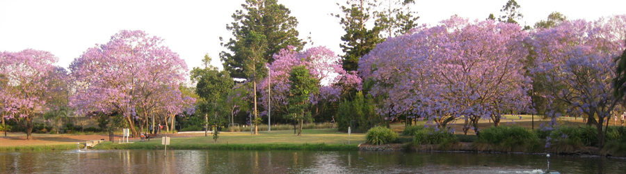

{fig-alt="Jacaranda trees in bloom beside the lake on the UQ St Lucia campus" width="100%"}


:::{#contact}

### Jan Engelstädter

####  &nbsp; j.engelstaedter@uq.edu.au

####  &nbsp; +61 7 336 57959

####  &nbsp; School of the Environment, The University of Queensland, St Lucia, QLD 4070, Australia


:::


```{r}
#| echo: false
#| label: make map
library(leaflet)
leaflet() %>%
  addTiles() %>%  # Add default OpenStreetMap map tiles
  addMarkers(lat=-27.49772, lng=153.01207)
```
<br>
