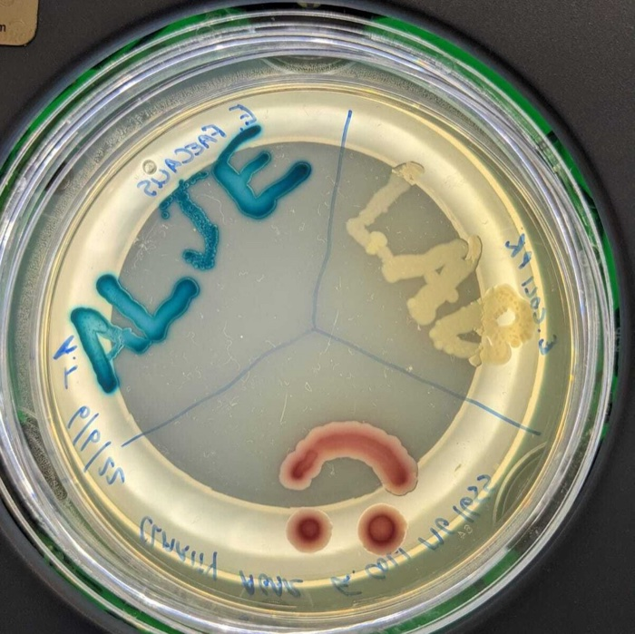

Welcome to the Engelstädter Lab 

Microbial evolutionary dynamics

::: {.home-text}

Welcome to the Engelstädter Lab, part of the [School of the Environment](https://environment.uq.edu.au/) at [The University of Queensland](https://www.uq.edu.au/) in Brisbane, Australia.

Our lab studies how bacteria adapt to their environments. Current research themes include the evolution of antibiotic resistance, microbial recombination and host-parasite coevolution. We use a wide range of methodological approaches, including mathematical models, computer simulations and lab experiments.

{.float-end .ms-4 .mb-3 width="120px" fig-alt="Petri dish with the words ALJE LAB and a smiley face written in coloured bacterial colonies"}We share our lab with [Dr Andrew Letten](https://andrewletten.net/), whose group is also working on antibiotic resistance in bacteria but more from an ecological angle. Together we form the ALJE lab.

:::
