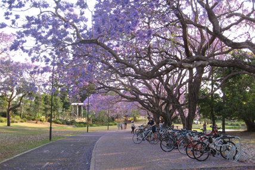
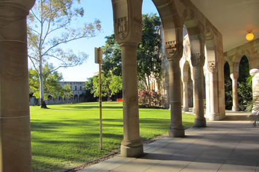
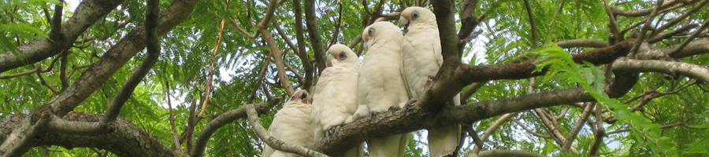

## PhD students

We are looking for a PhD student to work on the evolution of antibiotic resistance in bacteria! Specific projects are flexible and will be arrived at in discussion with the candidate. Possible topics that align with our previous research include the impact and evolution of natural transformation, integron evolution, fitness landscapes underlying drug resistance evolution and the predictability of evolutionary dynamics. We are looking for a highly motivated student with a strong background in evolutionary genetics, bioinformatics, mathematics and/or microbiology. Applicants should possess a Bachelor’s degree with Honours, Master of Science, MPhil or equivalent. Good communication skills, scientific curiosity and enthusiasm for research in evolutionary biology are essential. If you are interested, please send your full application (cover letter, CV, academic transcripts) or an informal inquiry to [j.engelstaedter@uq.edu.au](mailto:j.engelstaedter@uq.edu.au).

If you are interested in joining us as a PhD student but would like to work on a different topic, please also send an email to [j.engelstaedter@uq.edu.au](mailto:j.engelstaedter@uq.edu.au), including a CV and outlining what [area of research](../research/index.qmd) you would like to get involved in.

## Honours students

Several honours projects are available, please send an email to [j.engelstaedter@uq.edu.au](mailto:j.engelstaedter@uq.edu.au) outlining your research interests.

## PostDocs

PostDoc applications are very welcome. Although we currently don’t have any funding for postdoc positions, the Australian Research Council offers competitive postdoctoral fellowships through its [Discovery Early Career Researcher Award (DECRA)](https://www.arc.gov.au/funding-research/arc-funding-schemes/discovery/discovery-early-career-researcher-award-decra) scheme. If you are interested in applying for a DECRA or other external funding, please [get in touch](../contact/index.qmd).

## Some impressions of UQ's St Lucia Campus

::: {layout-ncol=2}
{fig-alt="Purple jacaranda trees in bloom on the UQ St Lucia campus"}

{fig-alt="The sandstone buildings of the Great Court at UQ St Lucia"}
:::

{fig-alt="Several white cockatoos perched together on a tree branch" width="100%"}
